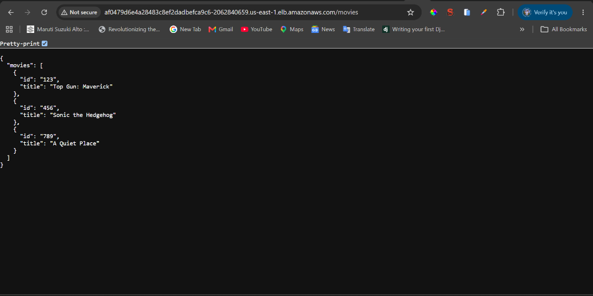
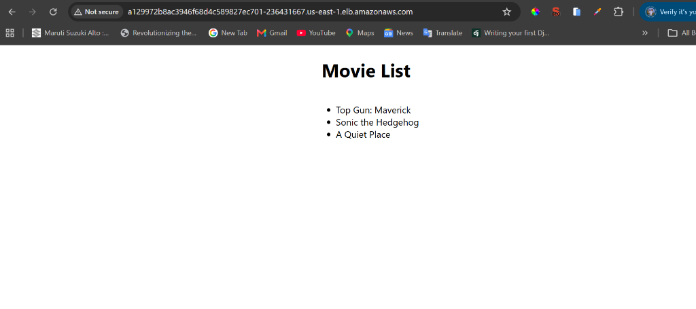
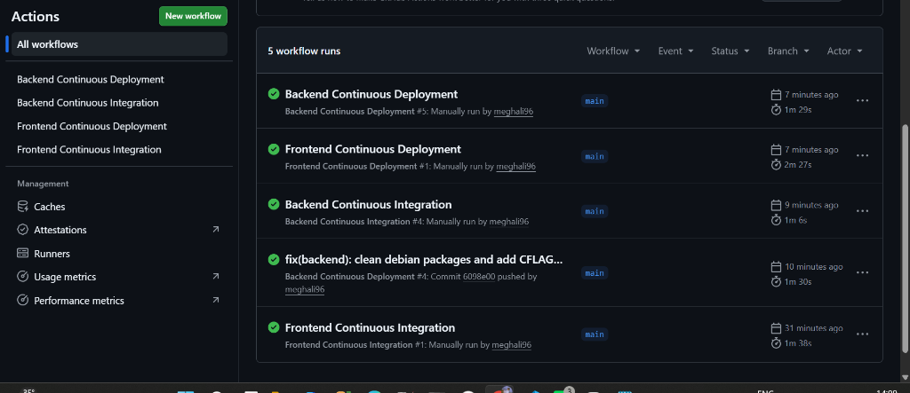
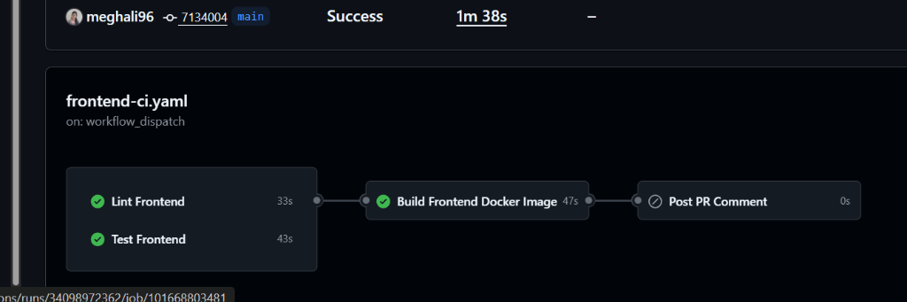
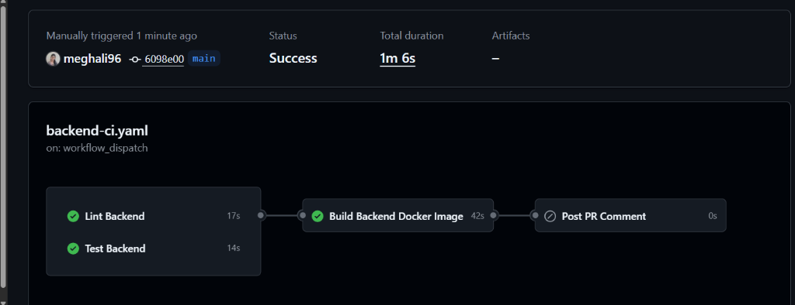
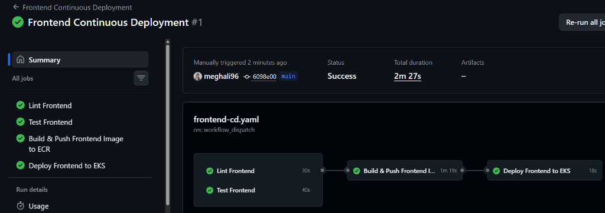
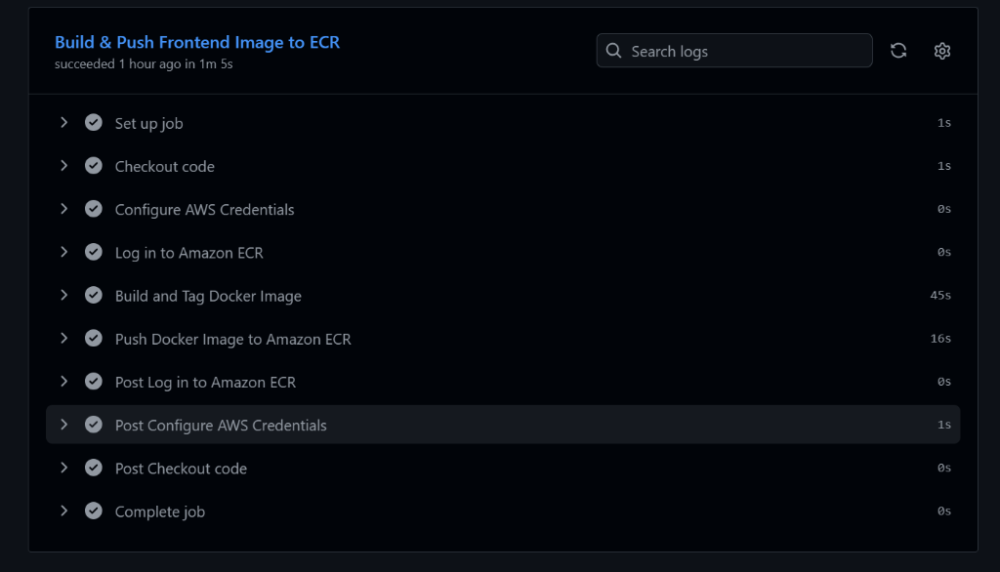
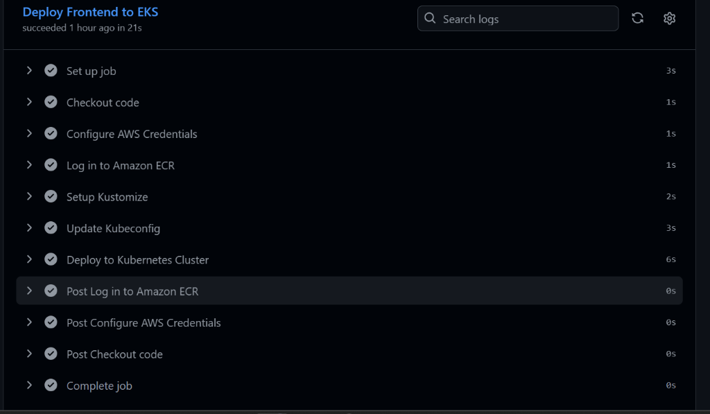
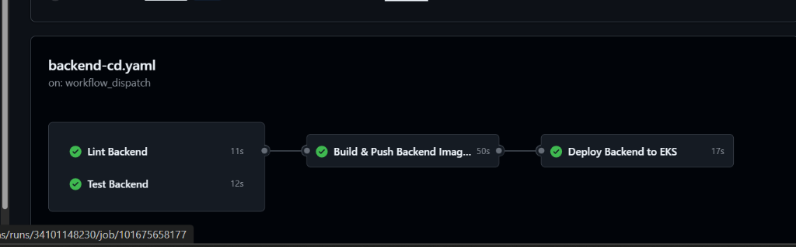

# Udacity Project Submission: Movie Picture CI/CD Pipeline

**Student Repository**: [https://github.com/meghali96/movie-picture-pipeline](https://github.com/meghali96/movie-picture-pipeline)

This document provides evidence of the implementation, testing, and deployment of the Movie Picture CI/CD Pipeline using GitHub Actions, Amazon ECR, and Amazon EKS.

---

## 1. Live Application Deployments

### Backend API (`/movies` endpoint)
- **Status**: Deployed and returning movies JSON list.
- **Service Endpoint**: `http://af0479d6e4a28483c8ef2dadbefca9c6-2062840659.us-east-1.elb.amazonaws.com/movies`

---

### Frontend Web Application
- **Status**: Deployed on Kubernetes via LoadBalancer.
- **Service Endpoint**: `http://a129972b8ac3946f68d4c589827ec701-236431667.us-east-1.elb.amazonaws.com`

---

## 2. GitHub Actions Workflows (All Passed)

All CI and CD workflows for both Frontend and Backend applications run cleanly with all checks passing:

---

## 3. Detailed Pipeline Executions

### Frontend Continuous Integration (`frontend-ci.yaml`)
- **Parallel Execution**: Lint and Test run concurrently.
- **Docker Build**: Dependent on `[lint, test]` success.

---

### Backend Continuous Integration (`backend-ci.yaml`)
- **Parallel Execution**: Lint and Test run concurrently.
- **Docker Build**: Dependent on `[lint, test]` success.

---

### Frontend Continuous Deployment (`frontend-cd.yaml`)
- **Jobs**: Lint ➔ Test ➔ Build & Push to Amazon ECR ➔ Deploy to EKS with Kustomize & `kubectl`.

#### Proof of Automated Deployment via GitHub Actions (Zero Manual Intervention)
The following execution logs confirm that the entire deployment was performed directly and automatically by GitHub Actions without any manual intervention:

1. **Build & Push to ECR Step**:

2. **Deploy to EKS Step (Kustomize & kubectl)**:

---

### Backend Continuous Deployment (`backend-cd.yaml`)
- **Jobs**: Lint ➔ Test ➔ Build & Push to Amazon ECR ➔ Deploy to EKS with Kustomize & `kubectl`.

---

## 4. Standout Features Implemented
1. **Custom Reusable Actions**:
   - [`.github/actions/pr-comment/action.yaml`](.github/actions/pr-comment/action.yaml): Reusable composite action that posts automated CI reports to Pull Requests.
   - [`.github/actions/k8s-deploy/action.yaml`](.github/actions/k8s-deploy/action.yaml): Reusable action to configure Kustomize and apply Kubernetes manifests.
2. **Reduced Build Times via Dependency Caching**:
   - `actions/cache@v4` on `~/.npm` for Node.js.
   - `actions/cache@v4` on `~/.local/share/virtualenvs` for Python Pipenv.
3. **Post-Workflow PR Commenting**: Automated commenting job on Pull Requests.
